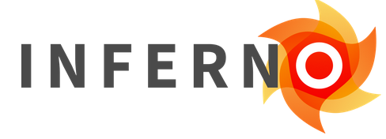

# API Certification Testing

## Inferno Framework
The <a target = "_blank" href = "https://inferno.healthit.gov/onc-certification-g10-test-kit">(g)(10) Standardized API Test Kit</a>, built using the <a target = "_blank" href = "https://inferno-framework.github.io/inferno-core/">Inferno Framework</a>, is used for (g)(10) API testing in the ONC Health IT Certification Program. The (g)(10) Standardized API Test Kit comes with all of the services necessary to test health IT modules seeking to meet the requirements of the Standardized API for patient and population services criterion finalized at § 170.315(g)(10). It is based on the requirements in the ONC Cures Act Final Rule and <a target = "_blank" href = "https://www.healthit.gov/test-method/standardized-api-patient-and-population-services#test_procedure">associated test procedure for § 170.315(g)(10)</a>.

!!! note ""
	

		{: style="height:100px"}
	

	
<a target = "_blank" href = "https://inferno.healthit.gov/">inferno.healthit.gov</a>

??? tip "Explore Inferno for (g)(10) Testing"
	**Inferno Walkthroughs/Documentation**

	  - <a target = "_blank" href = "https://youtu.be/FoBbbyddybA">Inferno Walkthrough</a>
	
	**Get Involved and Ask Questions**

	 - Join the <a target = "_blank" href = "https://groups.google.com/g/inferno-testing">Inferno Google Group</a> (*Google account required, join by clicking "joining the group"*). Here you will also find information on the **Inferno Monthly Tech Talk** meeting which is open to anyone and occurs on the second Wednesday of each month from 1 - 2 PM EST.
	 - Join the <a target = "_blank" href = "https://chat.fhir.org/#narrow/stream/179309-inferno">Inferno Zulip Stream</a> on chat.fhir.org (*creating a Zulip account is free*). This stream is actively monitored by Inferno's development team.
	 - Submit inquiries to ONC via the <a target = "_blank" href = "https://www.healthit.gov/feedback">Health IT Feedback Portal</a>.
	 - Submit discovered technical issues on <a target = "_blank" href = "https://github.com/onc-healthit/inferno-program/issues">GitHub</a>.

## Drummond G10+ FHIR API powered by Touchstone
In July 2022, <a target = "_blank" href = "https://www.healthit.gov/buzz-blog/healthit-certification/new-testing-method-available-for-standardized-api-criterion">ONC announced</a> the approval of the Drummond Group’s <a target = "_blank" href = "https://www.drummondgroup.com/compliance/payer-and-patient-access-certification/">Drummond G10+ FHIR API powered by Touchstone</a> tool, a new alternative test method (ATM) for testing conformance to ONC’s §170.315(g)(10) Standardized API for patient and population services certification criterion. Through this new ATM, software developers will now have a new option for conformance testing in addition to the previously approved Inferno (g)(10) Standardized API Test Kit. The approval of Drummond’s testing method continues ONC’s mission to further diversify the suite of test methods used as part of the ONC Health IT Certification Program.

## Real World Testing Condition and Maintenance of Certification

**Health IT developers are required to test the real-world use of APIs.**

The API criteria (§ 170.315(g)(7) through § 170.315(g)(10)) are included under the <a target = "_blank" href = "https://www.federalregister.gov/d/2020-07419/p-3580">Real World Testing Condition and Maintenance of Certification requirements of the ONC Cures Act Final Rule</a> in §170.405, which states:

!!! note ""
     “A health IT developer with Health IT Module(s) certified to any one or more 2015 Edition certification criteria in § 170.315(b), (c)(1) through (3), (e)(1), (f), (g)(7) through (10), and (h) must successfully test the real world use of those Health IT Module(s) for interoperability (as defined in 42 U.S.C.300jj(9) and § 170.102) in the type of setting in which such Health IT Module(s) would be/is marketed.” 
 
 More information can be found on the <a target = "_blank" href = "https://www.healthit.gov/sites/default/files/page/2021-02/Real-World-Testing-Fact-Sheet.pdf">Real World Testing Fact Sheet</a> and <a target = "_blank" href = "https://www.healthit.gov/sites/default/files/page/2021-08/ONC-Real%20World%20Testing%20Resource%20Guide_Aug%202021.pdf">Real World Testing Resource Guide</a>.

--8<-- "includes/abbreviations.md"