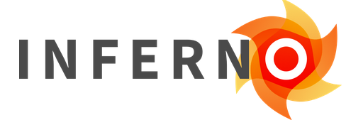
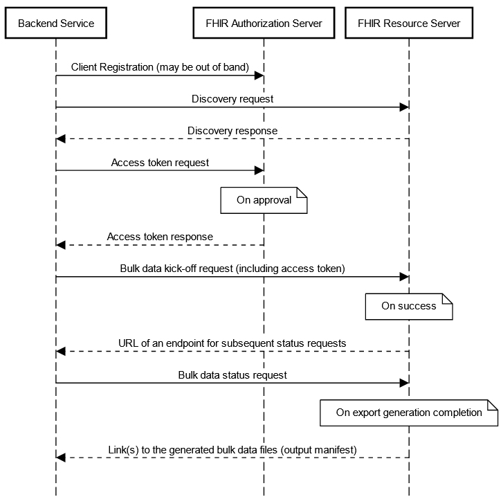
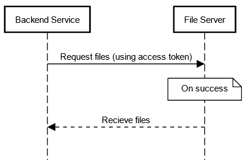

<!-- $criterion-endpoint{"test-method/standardized-api-patient-and-population-services"} -->

# Standardized API Certification Criterion at § 170.315(g)(10)

This section considers the standardized API for patient and population services certification criterion, including all of the content contained in the <a target = "_blank" href = "https://www.federalregister.gov/d/2020-07419/p-1162">ONC Cures Act Final Rule API preamble</a>, the <a target = "_blank" href = "https://www.federalregister.gov/d/2020-24376/p-136">IFC API preamble</a>, and the <a target = "_blank" href = "https://ecfr.federalregister.gov/current/title-45/subtitle-A/subchapter-D/part-170/subpart-C/section-170.315#p-170.315(g)(10)">regulation paragraphs in § 170.315(g)(10)</a>.

## Applicability
§ 170.315(g)(10) is applicable to all health IT developers who are certifying to the <a target = "_blank" href = "https://www.healthit.gov/topic/certification-ehrs/2015-edition-test-method/2015-edition-cures-update-base-electronic-health-record-definition">EHR base definition</a> on or after December 31, 2022.

The API certification criterion finalized in § 170.315(g)(10) was included as part of the EHR Base Definition at <a target = "_blank" href = "https://www.federalregister.gov/d/2020-07419/p-3216">§ 170.102</a>. While developers of health information technology are not required by the ONC to meet certification requirements, including certification requirements that are included as part of the EHR Base Definition, several federal, state and tribal entities, including <a target = "_blank" href = "https://www.cms.gov/">Centers for Medicare & Medicaid Services</a>, <a target = "_blank" href = "https://www.cdc.gov/">Centers for Disease Control and Prevention</a>, and other programs reference the ONC Health IT Certification Program and require the use of certified health IT for program participation.

## Inferno Testing Tool for Certification
The Inferno Program Edition is used for (g)(10) API testing for the ONC Health IT Certification Program. The Inferno Program Edition is a streamlined testing tool for services seeking to meet the requirements of the Standardized API for patient and population services criterion finalized at § 170.315(g)(10). It is based on the requirements in the ONC Cures Act Final Rule and <a target = "_blank" href = "https://www.healthit.gov/test-method/standardized-api-patient-and-population-services#test_procedure">associated test procedure for § 170.315(g)(10)</a>. This tool is used for testing and certification to the § 170.315(g)(10) certification criterion for the ONC Health IT Certification Program.

!!! note ""
	

		{: style="height:100px"}
	

	
<a target = "_blank" href = "https://inferno.healthit.gov/">inferno.healthit.gov</a>

??? tip "Explore Inferno for (g)(10) Testing"
	**Latest News**

	- ONC Buzz Blog: <a target = "_blank" href = "https://www.healthit.gov/buzz-blog/healthit-certification/calling-all-beta-testers-new-opportunity-to-help-onc-update-the-inferno-test-tool">Calling all Beta Testers: New Opportunity to help ONC Update the Inferno Test Tool</a>

	**Get Involved and Ask Questions**

	 - Join the <a target = "_blank" href = "https://groups.google.com/g/inferno-testing">Inferno Google Group</a> (*Google account required, join by clicking "joining the group"*). Here you will also find information on the **Inferno Monthly Tech Talk** meeting which is open to anyone and occurs on the second Wednesday of each month from 1 - 2 PM EST.
	 - Join the <a target = "_blank" href = "https://chat.fhir.org/#narrow/stream/179309-inferno">Inferno Zulip Stream</a> on chat.fhir.org (*creating a Zulip account is free*). This stream is actively monitored by Inferno's development team.
	 - Submit inquiries to ONC via the <a target = "_blank" href = "https://www.healthit.gov/feedback">Health IT Feedback Portal</a>.
	 - Submit discovered technical issues on <a target = "_blank" href = "https://github.com/onc-healthit/inferno-program/issues">GitHub</a>.

	 **Inferno Walkthroughs/Documentation**

	  - <a target = "_blank" href = "https://github.com/onc-healthit/inferno-program/wiki/Walkthrough">Inferno Walkthrough</a> (GitHub Wiki)
	 
	 **Previously Recorded Presentations**

	*Note that some of these may contain out-of-date information*

	 - <a target = "_blank" href = "https://youtu.be/OGzPC56gSBk">Robert Scanlon - FHIR API Testing with Inferno | DevDays June 2021 Virtual</a>
	 - <a target = "_blank" href = "https://youtu.be/QTY1HbigsjQ?t=254 ">Online FHIR® Meetup #4: FHIR Testing</a> (starting at 4:14)
	 - <a target = "_blank" href = "https://youtu.be/FAfS8veda1w">Steve Posnack & Robert Scanlon - Testing HL7® FHIR® Implementation Guides | DevDays 2020 June</a>
	 - <a target = "_blank" href = "https://youtu.be/C92CoKNV3KA">Robert Scanlon - FHIR Server Certification with Inferno | DevDays Redmond 2019</a>
	 - <a target = "_blank" href = "https://youtu.be/_i9C825GSSM ">Robert Scanlon - INFERNO | DevDays 2018 Amsterdam</a>

## Information and Clarifications

### Entire Criterion

<!-- $ref{g-10:CCG["Applies to Entire Criterion"], tabbed} -->
??? quote "*Clarifications included in the (g)(10) CCG that apply to the entire criterion*"
	- On December 31, 2022, the Application Programming Interface (API) certification criterion in § 170.315(g)(10) replaces the “Application access—data category request” certification criterion (§ 170.315(g)(8)).
	- Health IT Modules are not required to support patient-facing API-enabled “read” services for multiple patients for the purposes of this certification criterion.
	- The clinical note text included in any of the notes described in the “Clinical Notes Guidance” section of the US Core Implementation Guide (IG) adopted in § 170.215(a)(2) must be represented in a “plain text” form, and it would be unacceptable for the note text to be converted to another file or format (e.g., .docx, PDF) when it is provided as part of an API response. The intent of this policy is to prohibit Health IT Modules from converting clinical notes from a “machine readable” format to a non-“machine readable” format (e.g., PDF). Clinical note text that originates from outside Health IT Modules should be exchanged using its original format. Additionally, “plain text” does not necessarily mean the FHIR® “contentType” “text/plain.”
	- The US Core IG Profile “StructureDefinition-us-core-patient” element “name.suffix” is required for testing and certification in the Certification Program to meet the USCDI requirement to support the “Patient Demographics” Data Class: “Suffix” Data Element.
	- Either the US Core IG Profile “StructureDefinition-us-core-patient” element “name.period” or “name.use” is required for testing and certification in the ONC Certification Program to meet the USCDI requirement to support the “Patient Demographics” data class: “Previous Name” data element.
	- A Health IT Module must support at least one Choice or Reference for US Core IG “must support” elements with multiple Choices or References, respectively.
	- A Health IT Module must be conformant to the US Core IG for all Choices and References included in its standardized API, and cannot misrepresent Choices via the standardized API (e.g. a Health IT Module cannot transform “integer” values to “string” values).
	- A health IT developer must document which US Core IG Choices and References are supported by their Health IT Module via public technical documentation to meet the requirements at § 170.315(g)(10)(viii) and the transparency conditions at § 170.404(a)(2).
	- Information originating from the (g)(10)-certified Health IT Module must conform to the requirements included in the criterion, but legacy information and information from outside systems is not required to be mapped to the USCDI “Applicable Standards” and the US Core IG terminologies and value sets. However, health IT developers are encouraged to exceed the minimum requirements described in § 170.315(g)(10) to support the mapping of legacy information to the terminologies and value sets included in the USCDI and US Core IG where possible.
	- In order to mitigate potential interoperability errors and inconsistent implementation of the Fast Healthcare Interoperability Resources (FHIR®) Bulk Data Access (Flat FHIR®) (v1.0.0: STU 1) standard, ONC assesses, approves, and incorporates corrections (errata) as part of required certification and testing to this criterion. Compliance with the following errata is necessary because the errata implements technical corrections and clarifications to the FHIR® Bulk Data Access (Flat FHIR) (v1.0.0: STU 1) standard. There is a 90-day delay from the time the CCG has been updated with the ONC-approved errata to when compliance with the errata will be required to pass testing. Similarly, there will be an 18-month delay before a finding of an erratum’s absence in a Certified Health IT Module during surveillance would constitute a non-conformity under the Certification Program.
		- Version: <a href="https://hl7.org/fhir/uv/bulkdata/STU1.0.1/" target="_blank">FHIR Bulk Data Access (Flat FHIR) (v1.0.1: STU 1)</a>. Effective for testing on October 25, 2021. Surveillance compliance date on January 27, 2023.

*Additional clarifications that apply to the entire (g)(10) criterion:*

- The API certification criterion in § 170.315(g)(10) replaces the “application access—data category request” certification criterion (§ 170.315(g)(8)) and supports API-enabled “read” services for single and multiple patients.
- The term “services” includes all § 170.315(g)(10)-related technical capabilities included in a Health IT Module presented for testing and certification. The API-enabled “read” services for single patients is intended to support EHI requests and responses for individual patient records and the API-enabled “read” services for multiple patients is intended to support EHI requests and responses for multiple patients’ records.
- The scope of patient cohorts for “population services” can include various groups defined at the discretion of the user of the API-enabled “read” services for multiple patients, including, for example, a group of patients that meet certain disease criteria or fall under a certain insurance plan.
- The <a target = "_blank" href = "https://www.ecfr.gov/cgi-bin/text-idx?SID=034c12732e5cb9328303ecdf94ecde87&mc=true&tpl=/ecfrbrowse/Title45/45cfr171_main_02.tpl">information blocking policies</a> established by the <a target = "_blank" href = "https://www.federalregister.gov/d/2020-07419/p-1665">ONC Cures Act Final Rule</a> do not compel
healthcare providers to implement Health IT Modules certified to requirements in
§ 170.315(g)(10).
- While there may be slight variation between each instance of a Standardized API for patient and population services Health IT Module implemented by API Information Sources, ONC believes the standards that form the basis of the § 170.315(g)(10) certification criterion will enable interoperability across implementations.

### Data Response (Single Patient)
???+ quote "**Regulation text at § 170.315(g)(10)(i)(A)**" 
    (i) Data response. (A) Respond to requests for a single patient's data according to the standard adopted in § 170.215(a)(1) and implementation specification adopted in § 170.215(a)(2), including the mandatory capabilities described in “US Core Server CapabilityStatement,” for each of the data included in the standard adopted in § 170.213. All data elements indicated as “mandatory” and “must support” by the standards and implementation specifications must be supported.

<!-- $ref{g-10:CCG["Paragraph (g)(10)(i)(A)"], tabbed} -->
??? quote "*Clarifications included in the (g)(10) CCG that apply to paragraph § 170.315(g)(10)(i)(A)*"
	- All data elements and operations indicated as “mandatory” and “must support” by the standards and implementation specifications must be supported and are in-scope for testing.
	- For “Encounter,” “Organization,” and “Practitioner,” US Core IG profiles, only the “read” type interaction must be supported and will be included in testing and certification. For the “Location” FHIR resource, Health IT Modules must either demonstrate support for the “read” type interaction or demonstrate support for providing the “Location” and FHIR resource references as a contained resource. The “search” type interactions for these profiles and resource are not in scope for testing and certification. Health IT Modules must support these US Core IG profiles / FHIR resource because they are included as “must support” data elements in US Core IG profiles required by the USCDI.
	- Health IT Modules must support provenance according to the <a href="https://www.hl7.org/fhir/us/core/STU3.1.1/basic-provenance.html" target="_blank">“Basic Provenance Guidance” section of the US Core IG. </a>
	- For purposes of  ONC Health IT Certification , health IT developers that always provide HL7 FHIR "observation" values are not required to demonstrate Health IT Module support for “dataAbsentReason” elements. These include "dataAbsentReason" elements contained in the US Core implementation guide profiles and FHIR Vital Sign profiles that build on the HL7 FHIR "observation" and its derived profiles including HL7 FHIR "observation-vitalsigns", and HL7 FHIR "observation-oxygensat", including "component.dataAbsentReason" elements. However, health IT developers are still required to adhere to and demonstrate Health IT Module support for the <a href="http://hl7.org/fhir/us/core/STU3.1.1/general-guidance.html#missing-data" target="_blank">“Missing Data” section</a> of the US Core implementation guide.

!!! example "Examples of “must support” in the US Core IG 3.1.1:"
    In US Core 3.1.1, the profile element Observation.value[x] contains the following Choices:
    `Quantity, CodeableConcept, string, boolean, integer, Range, Ratio, SampledData, time, dateTime, Period`
    A Health IT Module must support at least one of these Choices via the (g)(10) standardized API.

    In US Core 3.1.1, the profile element Provenance.agent.who contains the following References:
    `US Core Practitioner Profile, US Core Patient Profile, US Core Organization Profile`
    A Health IT Module must support at least one of these References via the (g)(10) standardized API.

### Data Response (Multiple Patients)
???+ quote "**Regulation text at § 170.315(g)(10)(i)(B)**"
    (B) Respond to requests for multiple patients' data as a group according to the standard adopted in § 170.215(a)(1), and implementation specifications adopted in § 170.215(a)(2) and (4), for each of the data included in the standard adopted in § 170.213. All data elements indicated as “mandatory” and “must support” by the standards and implementation specifications must be supported.

<!-- $ref{g-10:CCG["Paragraph (g)(10)(i)(B)"], tabbed} -->
??? quote "*Clarifications included in the (g)(10) CCG that apply to paragraph § 170.315(g)(10)(i)(B)*"
	- Health IT Modules may support scopes using either “system/*.read” or a list of “system/[resource].read,” where [resource] is the FHIR® resource name, to enable the export of multiple patients’ data as a group.
	- During testing and certification for multiple patient services, Health IT Modules must demonstrate support for “Encounter,” “Organization,” and “Practitioner” US Core IG FHIR® Profiles.
	- Health IT Modules must demonstrate support for “Location” FHIR® resources by providing this resource as part of the multiple patient services response, or by including it as a contained resource as part of the multiple patient services response.
	- Health IT Modules must support provenance according to the <a href="https://www.hl7.org/fhir/us/core/STU3.1.1/basic-provenance.html" target="_blank">“Basic Provenance Guidance” section of the US Core IG. </a>

### Supported Search Operations (Single Patient)
???+ quote "**Regulation text at § 170.315(g)(10)(ii)(A)**"
    (ii) Supported search operations. (A) Respond to search requests for a single patient's data consistent with the search criteria included in the implementation specification adopted in § 170.215(a)(2), specifically the mandatory capabilities described in “US Core Server CapabilityStatement.”

<!-- $ref{g-10:CCG["Paragraph (g)(10)(ii)(A)"], tabbed} -->
??? quote "*Clarifications included in the (g)(10) CCG that apply to paragraph § 170.315(g)(10)(ii)(A)*"
	- All data elements indicated as “mandatory” and “must support” by the standards and implementation specifications must be supported and are in scope for testing.
	- The § 170.315(g)(10) certification criterion requires Health IT Modules to support API-enabled “read” services for single and multiple patients. “Read” services include those that allow authenticated and authorized third-party applications to view EHI through a secure API. These services specifically exclude “write” capabilities, where authenticated and authorized third-party applications would be able to create or modify EHI through a secure API.

*Additional Clarifications to the (g)(10) CCG:*

 - The scope of data available in the data responses defined in § 170.315(g)(10)(i) must be supported for searches for multiple patients via the supported search operations finalized in § 170.315(g)(10)(ii).

### Supported Search Operations (Multiple Patients)
???+ quote "**Regulation text at § 170.315(g)(10)(ii)(B)**"
    (B) Respond to search requests for multiple patients' data consistent with the search criteria included in the implementation specification adopted in § 170.215(a)(4)

<!-- $ref{g-10:CCG["Paragraph (g)(10)(ii)(B)"], tabbed} -->
??? quote "*Clarifications included in the (g)(10) CCG that apply to paragraph § 170.315(g)(10)(ii)(B)*"
	- No additional clarifications.

*Additional Clarifications to the (g)(10) CCG:*

- The scope of data available in the data responses defined in § 170.315(g)(10)(i) must be supported for searches for multiple patients via the supported search operations finalized in § 170.315(g)(10)(ii).
- The HL7® FHIR® Bulk Data Access (Flat FHIR®) (v1.0.0: STU 1) implementation specification adopted in § 170.215(a)(4) includes mandatory support for the “group-export” "OperationDefinition."
- ONC has not included a requirement for Bulk FHIR® import because the standards for these features are still being developed by industry. Applications or systems seeking to import information formatting according to the <a target = "_blank" href = "http://www.hl7.org/fhir/uv/bulkdata/history.cfml">HL7® FHIR® Bulk Data Access (Flat FHIR®) (V1.0.0:STU 1)</a> can use several methods developed by industry, or can refer to Bulk FHIR® import methods being defined by <a target = "_blank" href = "https://github.com/HL7/bulk-data">HL7® at the HL7® FHIR® Bulk Data GitHub page</a>.

### Application Registration
???+ quote "**Regulation text at § 170.315(g)(10)(iii)**"
    (iii) Application registration. Enable an application to register with the Health IT Module's “authorization server.”

<!-- $ref{g-10:CCG["Paragraph (g)(10)(iii)"], tabbed} -->
??? quote "*Clarifications included in the (g)(10) CCG that apply to paragraph § 170.315(g)(10)(iii)*"
	- Health IT presented for testing and certification must support app registration regardless of the scope of patient search utilized by the application (e.g. single or multiple).
	- This certification criterion requires a health IT developer, as finalized in the Condition of Certification requirements, to demonstrate its registration process, but does not require conformance to a standard.
	- The third-party application registration process that a health IT developer must meet under this criterion is not a form of review or “vetting” for purposes of this criterion.
	- For demonstration of the SMART IG "Standalone Launch" steps, health IT developers are permitted to scope US Core IG resources that do not exist in either the standard adopted at § 170.213 (USCDI version 1) or the "Compartment Patient" section of the standard adopted at § 170.215(a)(1) (HL7 FHIR Release 4.0.1) as either patient/[Resource] or user/[Resource]. These resources include “Encounter,” “Device,” “Location,” “Medication,” “Organization,” “Practitioner,” and “PractitionerRole.” Health IT developers must document their supported scopes according to the technical documentation requirements at § 170.315(g)(10)(viii)(A) and § 170.404(a)(2).

*Additional Clarifications to the (g)(10) CCG:*

- ONC expects that apps executed within an implementer’s clinical environment will be registered with an authorization server, but ONC does not require a health IT developer to demonstrate its registration process for these “provider-facing” apps.
- The requirement that health IT developers must enable an application to register with the § 170.315(g)(10)-certified Health IT Module’s authorization server only applies for the purposes of demonstrating technical conformance to the finalized certification criterion and API Condition and Maintenance of Certification requirements. The practices by all parties (including implementers of Health IT Modules) other than developers of Certified Health IT Modules are not in scope for this certification criterion nor the associated Condition and Maintenance of Certification requirements.
- Any practices associated with third-party application review or “vetting” by implementers must not violate the <a target = "_blank" href = "https://www.ecfr.gov/cgi-bin/text-idx?SID=034c12732e5cb9328303ecdf94ecde87&mc=true&tpl=/ecfrbrowse/Title45/45cfr171_main_02.tpl">information blocking provisions</a> established in the <a target = "_blank" href = "https://www.federalregister.gov/d/2020-07419/p-1665">ONC Cures Act Final Rule</a>.

### Secure Connection (Patient / User Scopes)
???+ quote "**Regulation text at § 170.315(g)(10)(iv)(A)**" 
    (iv) Secure connection. (A) Establish a secure and trusted connection with an application that requests data for patient and user scopes in accordance with the implementation specifications adopted in § 170.215(a)(2) and (3).

<!-- $ref{g-10:CCG["Paragraph (g)(10)(iv)(A)"], tabbed} -->
??? quote "*Clarifications included in the (g)(10) CCG that apply to paragraph § 170.315(g)(10)(iv)(A)*"
	- Connections below TLS version 1.2 must be denied.

### Secure Connection (System Scopes)
???+ quote "**Regulation text at § 170.315(g)(10)(iv)(B)**"
    (B) Establish a secure and trusted connection with an application that requests data for system scopes in accordance with the implementation specification adopted in § 170.215(a)(4).

<!-- $ref{g-10:CCG["Paragraph (g)(10)(iv)(B)"], tabbed} -->
??? quote "*Clarifications included in the (g)(10) CCG that apply to paragraph § 170.315(g)(10)(iv)(B)*"
	- Connections below TLS version 1.2 must be denied.

### First-time Authentication / Authorization for Single Patient Services
???+ quote "**Regulation text at § 170.315(g)(10)(V)(A)(1)**"
    (v) Authentication and authorization—(A) Authentication and authorization for patient and user scopes—(1) First time connections—(i) Authentication and authorization must occur during the process of granting access to patient data in accordance with the implementation specification adopted in § 170.215(a)(3) and standard adopted in § 170.215(b). (ii) A Health IT Module's authorization server must issue a refresh token valid for a period of no less than three months to applications capable of storing a client secret. (iii) A Health IT Module's authorization server must issue a refresh token for a period of no less than three months to native applications capable of securing a refresh token.

<!-- $ref{g-10:CCG["Paragraph (g)(10)(iv)(B)"], tabbed} -->
??? quote "*Clarifications included in the (g)(10) CCG that apply to paragraph § 170.315(g)(10)(v)(A)(1)*"
	- Health IT Modules will be explicitly tested for US Core IG operations using authentication and authorization tokens acquired via the process described in the implementation specification adopted in § 170.215(a)(3).
	- Only the relevant parts of the OpenID Connect Core 1.0 including errata set 1 adopted in § 170.215(b) that are also included in the implementation specification adopted in § 170.215(a)(3) will be in-scope for testing and certification.
	- The “SMART on FHIR Core Capabilities” in § 170.215(a)(3) are explicitly required for testing and certification because these capabilities are otherwise indicated as optional in the implementation specification. 
	- As part of the “permission-patient” “SMART on FHIR Core Capability” in § 170.215(a)(3), Health IT Modules presented for testing and certification must include the ability for patients to authorize an application to receive their electronic health information (EHI) based on FHIR® resource-level scopes. Specifically, this means patients would need to have the ability to authorize access to their EHI at the individual FHIR® resource level, from one specific FHIR® resource (e.g., “Immunization”) up to all FHIR® resources necessary to implement the standard adopted in § 170.213 and implementation specification adopted in § 170.215(a)(2).
	- Although Health IT Modules presented for testing and certification must include the ability for patients to authorize an application to receive their EHI based on FHIR® resource-level scopes, Health IT Modules are not prohibited from presenting authorization scopes in a more user-friendly format (e.g. grouping resources under categories, renaming the scopes for easier comprehension by the end-user, using more granular scopes), as long as the ability for patients to authorize applications based on resource-level scopes is available, if requested by the patient.
	- Health IT Modules will only be tested for the "Patient Access for Standalone Apps" and "Clinician Access for EHR Launch" scenarios described in the standard adopted at § 170.215(a)(3).
	- Since "Encounter" is not currently a USCDI Data Class or Data Element, we will not test Health IT Modules for support for "context-ehr-encounter" or "context-standalone-encounter" SMART on FHIR® Core Capabilities described in the standard adopted at § 170.215(a)(3). 
	- Implementers of § 170.315(g)(10)-certified Health IT Modules should be mindful of the information blocking provisions.
	- As part of the requirements at § 170.315(g)(10)(v)(A)(1)(iii), health IT developers must publish the method(s) by which their Health IT Modules support the secure issuance of an initial refresh token to native applications according to the technical documentation requirements at § 170.315(g)(10)(viii) and transparency conditions at § 170.404(a)(2). 
	- Application developer affirmations to health IT developers regarding the ability of their applications to secure a refresh token, a client secret, or both, must be treated in a good faith manner consistent with the provisions established in the openness and pro-competitive conditions at § 170.404(a)(4). 
	- Health IT developers can determine the method(s) they use to support interactions with native applications and clarify that health IT developers are not required to support all methods third-party application developers seek to use. 
	- ONC recognizes there may be some ambiguity in the HL7® <a href="http://hl7.org/fhir/smart-app-launch/" target="_blank"><a href="http://hl7.org/fhir/smart-app-launch/" target="_blank">SMART Application Launch Framework</a> Implementation Guide Release 1.0.0</a> standard (incorporated by reference at § 170.215(a)(3)) in its guidance for supporting native applications, in particular, in providing references to best practices, strategies, and examples such as “OAuth 2.0 for Native Apps: 8.5. Client Authentication”, “OAuth 2.0 Dynamic Client Registration Protocol”, and “universal redirect_uris” without a standardized solution. ONC provides flexibility for how the health IT developer implements the HL7® <a href="http://hl7.org/fhir/smart-app-launch/" target="_blank">SMART Application Launch Framework</a> implementation specification, as long as the  Certified Health IT Module supports for first time connections the issuance of three-month refresh tokens to native applications capable of securing a refresh token.
	- The paragraph at § 170.215(a)(3) requires health IT developers to support the SMART Application Launch Framework Implementation Guide (SMART IG) “SMART [on FHIR] Core Capabilities,” including “permission-offline,” which grants support for refresh tokens. The ONC Cures Act Final Rule states, “…Importantly, the implementation specification adopted in § 170.215(a)(3) requires that patients have the ability to explicitly enable the “offline_access” scope during authorization. If the “offline_access” scope is not enabled by patients, patients will be required to re-authenticate and re-authorize an application's access to their EHI after the application's access token expires…” (<a href="https://www.federalregister.gov/d/2020-07419/p-1254" target="_blank">85 FR 25747</a>). However, the ability of a patient to explicitly enable the “offline_access” scope during authorization is not described in the implementation specification. ONC clarifies that health IT developers must support the ability for patients to be provided information about an application’s request for persistent access prior to the patient sharing their health information, in order to enable patients to make an informed decision during authorization. Examples include, but are not limited to a health IT developer allowing patients to granularly grant “offline-access” scopes during authorization or clearly providing this information as a notice during authorization. The critical requirement is that patients are empowered to deny authorization for offline access.

*Additional Clarifications to the (g)(10) CCG:*

- ONC expects implementers of § 170.315(g)(10)-certified Health IT Modules to have the capability of revoking refresh tokens where appropriate.
- Neither § 170.315(g)(10) nor applicable API Condition and Maintenance of Certification requirements require restricting discretion of implementers (healthcare providers, clinician practices, hospitals, etc.) to set the length of refresh tokens for users of the API including patients and healthcare providers to align with their institutional policies.
- Implementers of § 170.315(g)(10)-certified Health IT Modules are not prohibited from implementing their § 170.315(g)(10)-certified Health IT Modules in accordance with their organizational security policies and posture, including by instituting policies for reauthentication and re-authorization (e.g., healthcare providers and/or patients could always be required to re-authenticate and re-authorize after a set number of refresh tokens have been issued).
- Patients are not prohibited from changing the length of refresh tokens to the degree this option is available to them.
- Implementers of § 170.315(g)(10)-certified Health IT Modules should be mindful of <a target = "_blank" href = "https://www.ecfr.gov/cgi-bin/text-idx?SID=034c12732e5cb9328303ecdf94ecde87&mc=true&tpl=/ecfrbrowse/Title45/45cfr171_main_02.tpl">information blocking provisions</a> applicable to them and that requiring patients to reauthenticate and re-authorize at a high frequency could inhibit patient access and implicate information blocking.

!!! info "Refresh Tokens for Native Applications"
    As specified in <a target = "_blank" href = "https://tools.ietf.org/html/rfc6749">RFC 6749</a> and the <a target = "_blank" href = "https://hl7.org/fhir/smart-app-launch/1.0.0/">HL7® SMART Application Launch Framework Implementation Guide Release 1.0.0</a>, some `native` applications are unable to claim they are `confidential`. By definition, these non-confidential `native` applications do not have a `client_secret` to exchange during the client authentication process. However, there are additional methods that non-confidential `native` applications can use to increase refresh token security during “First time connections.” Methods like Proof Key for Code Exchange (PKCE), the use of application-claimed, private-use Uniform Resource Identifier (URI) schemes as redirect URIs, and utilizing on device secure storage techniques to securely store the refresh token can increase the security of an initial refresh token. Methods like these ensure that an authorization server issues initial access and refresh tokens to the correct corresponding authorized application. The paragraph in § 170.315(g)(10)(v)(A)(1)(iii) requires that Health IT Modules provide support for the issuance of an initial refresh token to `native` applications capable of securing a refresh token.

!!! tip "OAuth Implementation Presentations"
	Below is a list of presentations that can be used by Certified Health IT Developers to kick-start their OAuth implementations.

	These presentations are best when consumed in the following order:

	1. <a target = "_blank" href = "https://youtu.be/rURoGATC4L8">OAuth2 Overview</a> - Overview of the OAuth2.0 standard and the Authorization Code Grant Type.
	1. <a target = "_blank" href = "https://youtu.be/zKudZCwTU4Q">SMART App Authorization Overview</a> - Overview of the SMART App Authorization and its value in implementing an interoperable OAuth2 compliant server.
	1. <a target = "_blank" href = "https://youtu.be/X7l3a_jN24g">SMART App Client Registration</a> - Information on different concepts and software code for Client Registration.
	1. <a target = "_blank" href = "https://youtu.be/MjTskVYjDNc">SMART App Client Authorization Part 1</a> - Indepth look at the authorization process, the requests and the specification.
	1. <a target = "_blank" href = "https://youtu.be/lFolfRSVWJE">SMART App Client Authorization Part 2</a> - Indepth look at the code used for Client Authorization in Part 1.

	Video downloads and PowerPoint slides can be found here: <a target = "_blank" href = "https://github.com/onc-healthit/oauth-samples">oauth-samples</a>

### Subsequent Authentication / Authorization for Single Patient Services
???+ quote "**Regulation text at § 170.315(g)(10)(V)(A)(2)**"
    (2) Subsequent connections. (i) Access must be granted to patient data in accordance with the implementation specification adopted in § 170.215(a)(3) without requiring reauthorization and re-authentication when a valid refresh token is supplied by the application. (ii) A Health IT Module's authorization server must issue a refresh token valid for a new period of no less than three months to applications capable of storing a client secret.

<!-- $ref{g-10:CCG["Paragraph (g)(10)(iv)(B)"], tabbed} -->
??? quote "*Clarifications included in the (g)(10) CCG that apply to paragraph § 170.315(g)(10)(V)(A)(2)*"
	- No additional clarifications.

*Additional Clarifications to the (g)(10) CCG:*

- For subsequent connections, Certified Health IT Modules are not required to issue a new
refresh token, but must issue a refresh token valid for a new period of no less than three
months. Whether the application receives a “new” refresh token is an implementation
decision left to the health IT developer, as long as the “refreshed” refresh token is valid for a
new period of no less than three months.

!!! info "Refresh Tokens and Clients "Capable of Storing a Client Secret""
    As specified in <a target = "_blank" href = "https://tools.ietf.org/html/rfc6749">RFC 6749</a> and the <a target = "_blank" href = "http://hl7.org/fhir/smart-app-launch/">HL7® SMART Application Launch Framework Implementation Guide Release 1.0.0</a>, authorization servers send and receive refresh tokens from their clients in two different parts of an OAuth 2.0 flow. First, after resource owner authorization, the authorization server sends an initial refresh token to the client with the initial access token. Second, when an access token has expired and needs to be refreshed, a client exchanges a refresh token for a new access token and optionally another refresh token, which occurs without user authorization. During both exchanges, security is increased (i.e. protecting against leaked refresh tokens) for `confidential` clients that have a client secret used for client authentication. The (g)(10) criterion paragraphs at § 170.315(g)(10)(v)(A)(1)(ii) and § 170.315(g)(10)(v)(A)(2)(ii) require that clients “capable of storing a client secret” must be given refresh tokens during both of these parts of the OAuth 2.0 flow. Requiring that such clients be given a refresh token valid for a new period of three months during this second part of the OAuth 2.0 flow enables indefinite persistent access without the need for user re-authorization.

### Authentication / Authorization for Multiple Patient Services
???+ quote "**Regulation text at § 170.315(g)(10)(v)(B)**" 
    (B) Authentication and authorization for system scopes. Authentication and authorization must occur during the process of granting an application access to patient data in accordance with the “SMART Backend Services: Authorization Guide” section of the implementation specification adopted in § 170.215(a)(4) and the application must be issued a valid access token.

<!-- $ref{g-10:CCG["Paragraph (g)(10)(v)(B)"], tabbed} -->
??? quote "*Clarifications included in the (g)(10) CCG that apply to paragraph § 170.315(g)(10)(v)(B)*"
	- Authentication and authorization must occur during the process of granting an application access to patient data in accordance with the “SMART Backend Services: Authorization Guide” section of the implementation specification adopted in § 170.215(a)(4) and the application must be issued a valid access token. In order for the issued access token to be valid, the application must be able to access patient data using that issued access token. Health IT developers may support additional access-control schemes beyond OAuth 2.0.

<!-- https://sequencediagram.org/ -->
??? info "Authentication / Authorization for Multiple Patient Services: Sequence Diagrams"
	The Bulk Data Export and Authentication/Authorization sequences, according to the §170.315(g)(10) requirements, are described below.

	First, according to <a target = "_blank" href = "https://www.federalregister.gov/d/2020-07419/p-3468">§170.315(g)(10)(v)(B)</a>, Authentication and authorization must occur during the process of granting an application access to patient data in accordance with the “<a target = "_blank" href = "https://hl7.org/fhir/uv/bulkdata/STU1.0.1/authorization/index.html">SMART Backend Services: Authorization Guide</a>” section of the Bulk Data implementation guide.
	
	

	*Note that generated Bulk Data files <a target = "_blank" href = "https://hl7.org/fhir/uv/bulkdata/STU1.0.1/export/index.html#response---complete-status">may</a> be served by file servers other than a FHIR-specific server.*

	There are different ways for a client to receive generated Bulk Data files including via <a target = "_blank" href = "https://confluence.hl7.org/display/FHIRI/Capability+URLs+for+Download+Links">Capability URLs for Download Links</a>. The client will refer to the `requiresAccessToken` field included in the output manifest when retrieving files.

	If `reqiresAccessToken = true`

	

	If `reqiresAccessToken = false`	

	

	It is critical that server developers follow the HL7 guidance on  <a target = "_blank" href = "https://confluence.hl7.org/display/FHIRI/Capability+URLs+for+Download+Links">Capability URLs for Download Links</a> when choosing to generate output manifests with `requiresAccessToken = false`.

### Patient Authorization Revocation
???+ quote "**Regulation text at § 170.315(g)(10)(vi)**" 
    (vi) Patient authorization revocation. A Health IT Module's authorization server must be able to revoke an authorized application's access at a patient's direction.

<!-- $ref{g-10:CCG["Paragraph (g)(10)(vi)"], tabbed} -->
??? quote "*Clarifications included in the (g)(10) CCG that apply to paragraph § 170.315(g)(10)(vi)*"
	- This is a functional requirement to allow health IT developers the ability to implement it in a way that best suits their existing infrastructure and allows for innovative models for authorization revocation to develop.
	- Patients are expected to have the ability to revoke an authorized application’s access to their EHI at any time.
	- For authorization revocation, Health IT Modules presented for certification are permitted to allow short-lived access tokens to expire in lieu of immediate access token revocation. ONC recommends health IT developers limit the lifetime of access tokens to one hour or less as recommended in the standard adopted at § 170.215(a)(3), HL7® <a href="https://hl7.org/fhir/smart-app-launch/1.0.0/" target="_blank">SMART Application Launch Framework Implementation Guide Release 1.0.0</a>. For purposes of testing and certification, Health IT Modules will be tested for patient authorization revocation occurring within one hour of the request.

### Token Introspection
???+ quote "**Regulation text at § 170.315(g)(10)(vii)**" 
    (vii) Token introspection. A Health IT Module's authorization server must be able to receive and validate tokens it has issued.

<!-- $ref{g-10:CCG["Paragraph (g)(10)(vii)"], tabbed} -->
??? quote "*Clarifications included in the (g)(10) CCG that apply to paragraph § 170.315(g)(10)(vii)*"
	- Although ONC does not specify a standard for token introspection, ONC encourages industry to coalesce around using a common standard, like OAuth 2.0 Token Introspection (RFC 7662).

### Technical API Documentation Content
???+ quote "**Regulation text at § 170.315(g)(10)(viii)(A)**" 
    (viii) Documentation. (A) The API(s) must include complete accompanying documentation that contains, at a minimum: (1) API syntax, function names, required and optional parameters supported and their data types, return variables and their types/structures, exceptions and exception handling methods and their returns. (2) The software components and configurations that would be necessary for an application to implement in order to be able to successfully interact with the API and process its response(s). (3) All applicable technical requirements and attributes necessary for an application to be registered with a Health IT Module's authorization server.

<!-- $ref{g-10:CCG["Paragraph (g)(10)(viii)(A)"], tabbed} -->
??? quote "*Clarifications included in the (g)(10) CCG that apply to paragraph § 170.315(g)(10)(viii)(A)*"
	- Health IT developers are not required to re-publish documentation from the adopted standards and implementation specifications. However, health IT developers must publish documentation that goes beyond the adopted standards and implementation specifications.
	- Health IT developers are expected to disclose any additional data their § 170.315(g)(10)-certified Health IT Module supports in the context of the adopted standards and implementation specifications.

### Technical API Documentation Availability
???+ quote "**Regulation text at § 170.315(g)(10)(viii)(B)**"
    (B) The documentation used to meet paragraph (g)(10)(viii)(A) of this section must be available via a publicly accessible hyperlink without any preconditions or additional steps.

<!-- $ref{g-10:CCG["Paragraph (g)(10)(viii)(B)"], tabbed} -->
??? quote "*Clarifications included in the (g)(10) CCG that apply to paragraph § 170.315(g)(10)(viii)(B)*"
	- No additional clarifications.

<!-- ## Test Procedures
### Paragraph (g)(10)(iii) – Application registration
**Application Registration**

1. The health IT developer demonstrates the Health IT Module supports application registration with an authorization server for the purposes of Electronic Health Information (EHI) access for single patients, including support for application registration functions to enable authentication and authorization in § 170.315(g)(10)(v).
1. The health IT developer demonstrates the Health IT Module supports application registration with an authorization server for the purposes of EHI access for multiple patients including support for application registration functions to enable authentication and authorization in § 170.315(g)(10)(v).

### Paragraph (g)(10)(iv) – Secure connection
**Secure connection** -->

--8<-- "includes/abbreviations.md"