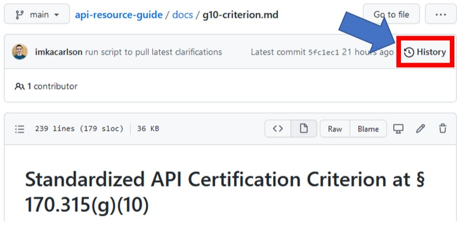
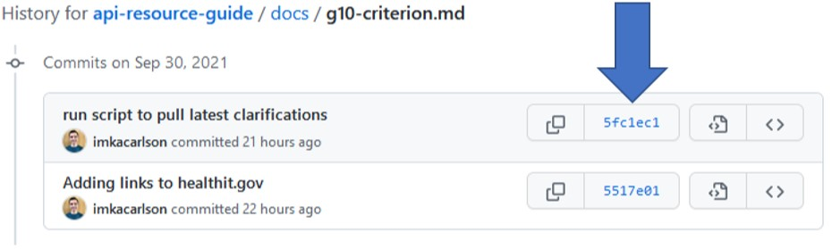
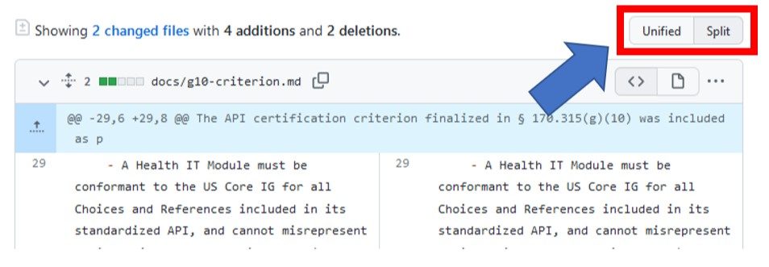

## Viewing line item differentials in GitHub
The code and content for this resource is publicly <a href = "https://github.com/onc-healthit/api-resource-guide" target = "_blank">available on GitHub</a>. On of the key features of GitHub is the ability to easily view line item differentials (diffs) between versions:

1. Navigate to the API Resource Guide repository on GitHub: <a href = "https://github.com/onc-healthit/api-resource-guide" target = "_blank">onc-healthit/api-resource-guide</a>.
1. The relevant documents containing the ONC certification program information rendered on this website are located in the `docs` directory of the `api-resource-guide` repository.
1. Click on a `.md` file that you want to inspect the history of.
1. To browse the commit history click on the "History" button in the upper right hand corner of the page.
    <figure>
        
        <figcaption>History button on GitHub</figcaption>
    </figure>
1. You are now on the page that shows the "commit" history for this file. Click on the button containing the hash of the commit you want to inspect.
    <figure>
        
        <figcaption>Button containing commit hash on GitHub</figcaption>
    </figure>
1. Now you can see the specific lines that changed with this commit.

    !!! tip
        Toggle between different views on GitHub using the "Unified" and "Split" buttons.
        <figure>
            
            <figcaption>Toggling between "Unified" and "Split" views on GitHub</figcaption>
         </figure>

1. Additional information can be found on GitHub Docs: <a href = "https://docs.github.com/en/github/committing-changes-to-your-project/viewing-and-comparing-commits/differences-between-commit-views" target = "_blank">Differences between commit views</a>.